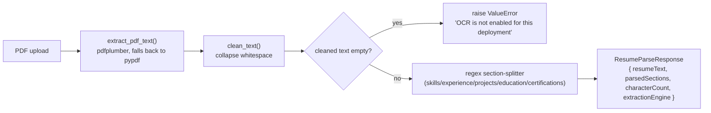
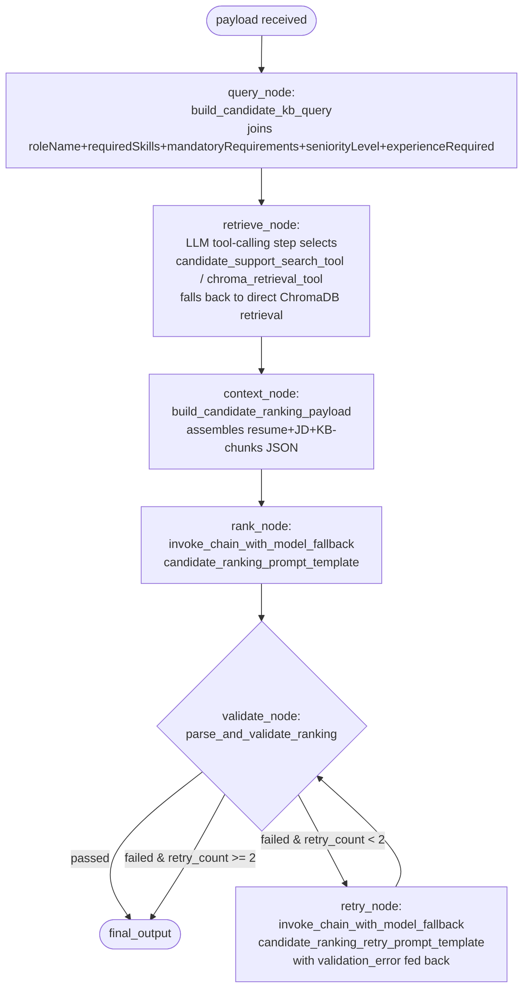
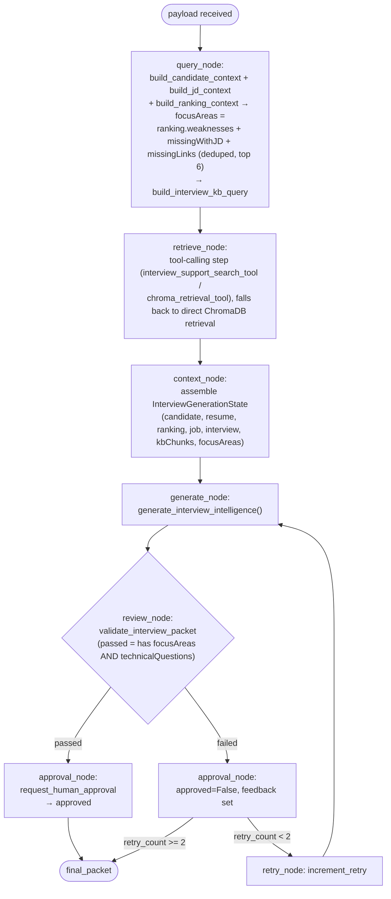
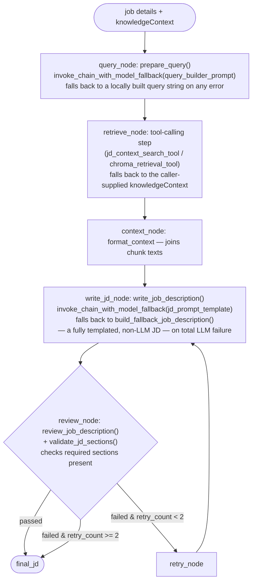
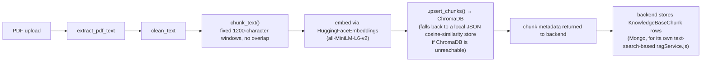
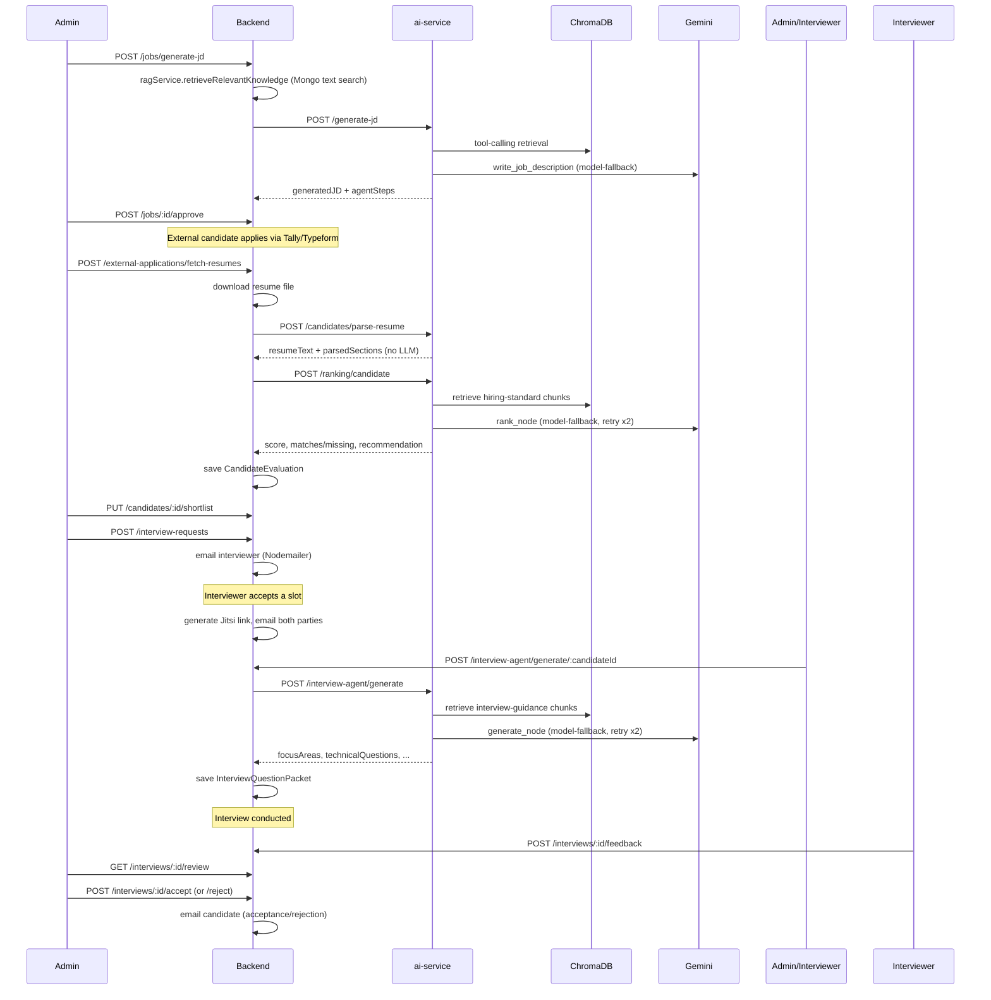

# AI Workflow

All AI capability lives in the `ai-service` (Python/FastAPI) and is invoked exclusively by the backend's `aiServiceClient.js`. Every capability is implemented as a LangGraph state machine (except resume parsing, which is pure deterministic code) living under `ai-service/app/<capability>/`.

## AI Provider and Models

- **Provider**: Google Gemini only. `ai-service/app/shared/config/settings.py` reads `AI_PROVIDER` and `get_llm()` (`shared/llm/gemini_client.py`) raises `GeminiRequestError` immediately if it isn't `"gemini"`.
- **Primary model**: `GEMINI_MODEL` env var (compose sets `gemini-2.0-flash`; code default if unset is `gemini-1.5-flash`).
- **Fallback models**: `GEMINI_FALLBACK_MODELS` (default `gemini-2.5-flash,gemini-2.5-pro,gemini-2.0-flash-lite`).
- **Client**: `ChatGoogleGenerativeAI` from `langchain-google-genai`, with `convert_system_message_to_human=True` and `max_retries=0` (LangChain-level retries are disabled; retry logic is handled explicitly by this codebase's own graphs and the model-fallback invoker, not by the LangChain client).
- **Model instances are cached** per `(temperature, model_name, max_output_tokens)` tuple in `gemini_client.py`'s `_llm_cache`.
- **Embeddings**: `all-MiniLM-L6-v2` via `langchain-huggingface`'s `HuggingFaceEmbeddings` (`EMBEDDING_MODEL_NAME`/`EMBEDDING_PROVIDER`), with a deterministic SHA-256-based hash embedding as a last-resort fallback if the model fails to load (`shared/embeddings/service.py`).

### Model-Fallback Retry (`shared/llm/invoker.py`)

```python
def invoke_chain_with_model_fallback(chain_builder, input_data, *, label="chain"):
    for model_name in model_candidates():          # [GEMINI_MODEL, *GEMINI_FALLBACK_MODELS], de-duplicated
        try:
            return chain_builder(model_name).invoke(input_data)
        except Exception as error:
            if is_quota_or_rate_limit_error(error):  # matches "429", "quota", "rate limit", "resourceexhausted"
                continue                              # try the next model
            raise                                      # any other error fails immediately
    raise last_error
```

This is used by **all three** LLM-backed capabilities (JD generation, ranking, interview-packet generation) — a quota/rate-limit `429` on the primary model transparently retries the same prompt against the next configured model instead of failing the whole request.

---

## Resume Parsing (`app/resume/`) — No LLM

**Endpoint**: `POST /candidates/parse-resume` (multipart PDF upload)



- `parser.py`'s `_find_section_text` looks for lines that are exactly a known section heading (e.g. `"skills"`, `"technical skills"`, `"technologies"`) and captures the following lines up to the next recognized heading (or 16 lines).
- Experience entries are split by comma/pipe/bullet/newline/semicolon into up to 8 items, each becoming `{ role: item[:120], company: "", duration: "", highlights: [item] }` — this is a heuristic, not true structured parsing.
- Because there is no LLM call, this step is **immune to Gemini quota/availability issues** — it only fails if the PDF is genuinely unreadable (scanned image with no OCR, corrupt file).
- The backend (`candidateController.processCandidateResume`) additionally requires the returned `resumeText` to be ≥ 50 characters, or it rejects the upload with a `422`.

---

## Candidate Ranking (`app/ranking/`)

**Endpoint**: `POST /ranking/candidate` — invoked by `candidateController.rankSingleCandidate`, itself called from `rankCandidate`, `rankAllCandidates`, and automatically after a successful resume fetch/import (`importExternalCandidateSubmission`).

**Request payload** (`CandidateRankingRequest`):
```json
{
  "candidate": { "_id", "name", "email", "phone", "currentCompany", "yearsOfExperience", "source", "notes" },
  "resume": { "resumeText": "...", "parsedSections": { "skills": [...], "experience": [...], "projects": [...], "education": "...", "certifications": [...] } },
  "job": { "_id", "roleName", "department", "requiredSkills", "mandatoryRequirements", "seniorityLevel", "experienceRequired", "fullJDText" }
}
```

### LangGraph pipeline (`ranking/graph.py`)



- **Hard preconditions** (`context.py:build_candidate_context`) — raises `ValueError` (surfaced as a `500` from the FastAPI route, then wrapped by the backend as the candidate's `rankingError`) if:
  - `resume.resumeText` is empty
  - `job.roleName` is empty
  - `job.fullJDText`, `job.requiredSkills`, and `job.mandatoryRequirements` are **all** empty
  - The knowledge-base retrieval returned **zero chunks** — ranking is a "tri-source RAG" design that requires company hiring-standard chunks to exist in ChromaDB; if the knowledge base is empty, ranking cannot run.
- **System prompt** (`ranking/prompts.py`) instructs the model: score using weights *JD skill match 40%, experience match 25%, project relevance 15%, company KB alignment 10%, mandatory requirement fit 10%*; return strict JSON only; max 3 items per array, ≤80 chars each; `rankingReason` ≤160 chars; explicitly forbids generic fallback language.
- **Output schema** (`CandidateRankingResponse` in `ranking/schemas.py`): `score` (0–100), `matchesWithJD`/`missingWithJD`/`missingLinks`/`strengths`/`weaknesses` (string arrays, `strengths`/`weaknesses` require ≥1 item), `recommendation` (`Shortlist|Review|Reject`), `rankingReason` (≥8 chars), `companyContext` (KB chunks used), `rawModelOutput`.
- **Normalization** (`ranking/parser.py`): if the LLM omits `strengths`/`weaknesses`, they are backfilled with the literal strings `"No strong evidence returned"` / `"No weakness detail returned"` — **these exact fallback strings are a signal that the LLM call did not return usable content** (e.g. every model attempt was quota-limited, or the raw output failed JSON parsing on both the primary and retry attempts). Seeing this text in the UI means the candidate was not genuinely evaluated.
- **Retry loop**: max 2 retries (`shared/base/graph.py:should_retry`), each retry re-sends the validation error and a preview of the invalid raw output to the model.
- The backend then persists a new `CandidateEvaluation` document and points `Candidate.latestEvaluation` at it (`candidateController.saveEvaluation`), preserving prior evaluations as history.

---

## Interview Question Packet Generation (`app/interview/`)

**Endpoint**: `POST /interview-agent/generate` — invoked by `interviewAgentController.generateForCandidate`, requiring the candidate to already have both a parsed resume and a `latestEvaluation` (i.e. ranking must run before interview-packet generation).

**Request payload** (`InterviewGenerationRequest`):
```json
{
  "candidate": { "_id", "name", "email", "currentCompany", "yearsOfExperience", "notes" },
  "resume": { "resumeText", "parsedSections" },
  "ranking": { "score", "matchesWithJD", "missingWithJD", "missingLinks", "strengths", "weaknesses", "recommendation", "rankingReason" },
  "job": { "_id", "roleName", "department", "skills", "mandatoryRequirements", "seniorityLevel", "experienceRequired", "approvedJD" },
  "interview": { "_id", "roundType", "duration", "scheduledAt", "status", "recruiterNotes" }
}
```

### LangGraph pipeline (`interview/graph.py`)



`generate_interview_intelligence` (`interview/service.py`) itself has a 3-tier fallback:
1. Call `invoke_chain_with_model_fallback` with the primary prompt (or the retry prompt, if `review_feedback` is present from a prior failed review).
2. If that raises, retry once more explicitly via the retry chain with the exception message as `validation_error`.
3. If that **also** raises, fall back to a locally-constructed packet: `focusAreas` = the ranking-derived gap list computed in `context.py` (`state.focusAreas`), and **all question arrays empty** — this is the "packet came back empty" failure mode users see when Gemini is completely unreachable across every configured model.

- **System prompt** (`interview/prompts.py`): *"You are InterviewQuestionAgent, a senior technical interviewer copilot... Do not generate generic trivia. Every question must be tied to the candidate, role, gap, project, or hiring standard... Return strict valid JSON only."* The prompt payload includes `requiredOutputSchema` (an example shape) and `constraints` (exact counts: 4 technical, 3 follow-up, 3 weakness-probe, 3 behavioral, 2 system-design questions, each under 180 characters).
- **Output schema** (`InterviewQuestionPacket`): `focusAreas` (≤8 strings), `technicalQuestions`/`followUpQuestions`/`weaknessProbes`/`behavioralQuestions` (≤5-6 `{question, whyAsk, strongSignal}` objects each), `systemDesignQuestions` (≤4), `evaluationChecklist` (≤10 strings), `interviewerNotes` (≤8 strings), `rawModelOutput`.
- **Persistence**: the backend saves the normalized packet as an `InterviewQuestionPacket` document (`interviewAgentController.generateForCandidate`), keyed by `candidateId` + optional `interviewId`. If a packet already exists for that key and `force` is not set, the existing packet is returned without calling the AI service again (caching).
- **Review gate**: `validators.py`'s `validate_interview_packet` only passes if the packet has *both* non-empty `focusAreas` and non-empty `technicalQuestions` — otherwise `review_passed=False` and the graph retries (up to 2 times) before giving up and returning whatever was produced (which may be the empty fallback packet described above).

---

## Job Description (JD) Generation (`app/jd/`)

**Endpoint**: `POST /generate-jd` (also aliased at `POST /api/jd/generate`) — invoked by `jobController.generateJD`.



- **Required sections**: Role Summary, Responsibilities, Required Qualifications, Preferred Qualifications, Job Details, Mandatory Requirements (`jd/parser.py:REQUIRED_JD_SECTIONS`). If the LLM omits any, `review_job_description` appends `"## <Section>\n- To be refined by recruiter."` placeholders rather than failing outright.
- **Internal-context leakage guard**: `remove_internal_context` strips any section/heading matching `"knowledge base context"`, `"retrieved context"`, `"source documents"`, `"sources used"`, `"rag metadata"`, etc., so the final JD never exposes internal RAG plumbing to candidates. The backend's `jobController.sanitizeGeneratedJD` applies a second, similar pass server-side as defense in depth.
- **This is the only capability with a true non-LLM fallback that still produces a usable JD** (`build_fallback_job_description` in `jd/service.py`) — even if Gemini is completely unreachable, JD generation returns a templated but complete job description rather than an error.
- **Knowledge retrieval for JD generation is dual-sourced**: the backend's own `ragService.js` (MongoDB `$text` search over `KnowledgeBaseChunk`, scoped by an inferred role category — `machine_learning`/`frontend`/`backend`/`data_science`/`qa`) supplies `knowledgeContext` in the request payload; the ai-service's `retrieve_node` *also* independently queries ChromaDB via tool-calling and prefers those results if the tool call returns anything, otherwise using the backend-supplied context as a fallback.

---

## Knowledge Base Ingestion (`app/knowledge/`) — No LLM for indexing

**Endpoint**: `POST /knowledge/index-pdf` — invoked by `aiKnowledgeIndexService.js` right after a PDF upload in `knowledgeBaseController.uploadDocument`.



- Chunk IDs are `"{documentId}:{chunkIndex}"`, allowing idempotent re-indexing.
- If ChromaDB is down, `shared/chroma/store.py` transparently writes chunk+embedding+metadata to `chroma_data/fallback_vector_store.json` and later does in-process cosine similarity search against it — retrieval quality is preserved (approximately) even without the vector database running, at the cost of O(n) search and no persistence guarantees beyond the JSON file.

---

## Error Handling & Retry Logic — Summary

| Layer | Mechanism |
|---|---|
| Model quota/rate-limit (`429`) | `invoke_chain_with_model_fallback` retries the same prompt across `[GEMINI_MODEL, *GEMINI_FALLBACK_MODELS]` |
| Invalid/malformed LLM JSON output | Each graph's `validate`/`review` node routes to a `retry` node (max 2 retries) that re-prompts with the specific validation error and a preview of the bad output |
| Total LLM failure (all models, all retries exhausted) | **JD generation**: falls back to a templated, fully non-LLM job description. **Ranking**: raises, and the backend records `rankingStatus: "failed"` with the error message; no evaluation is saved. **Interview packets**: falls back to an empty-questions packet seeded only with ranking-derived `focusAreas`. |
| ChromaDB unavailable | `shared/chroma/store.py` and `shared/chroma/client.py` transparently degrade to a local JSON-file vector store with cosine-similarity search |
| Resume PDF unreadable | `resume/parser.py` raises `ValueError("No extractable text found in PDF")`; the backend surfaces this as a `500`/`422` and does not create a `CandidateResume` |
| Missing `GEMINI_API_KEY` | `gemini_client.get_llm()` raises `GeminiRequestError` immediately — no retry, since no model would succeed |
| Backend → ai-service network/route errors | `aiServiceClient.js`'s `extractAiError` detects `404`s on known AI routes and returns an explicit "rebuild/restart the AI service" hint instead of a generic error |

## End-to-End Workflow: Full Hiring Cycle


