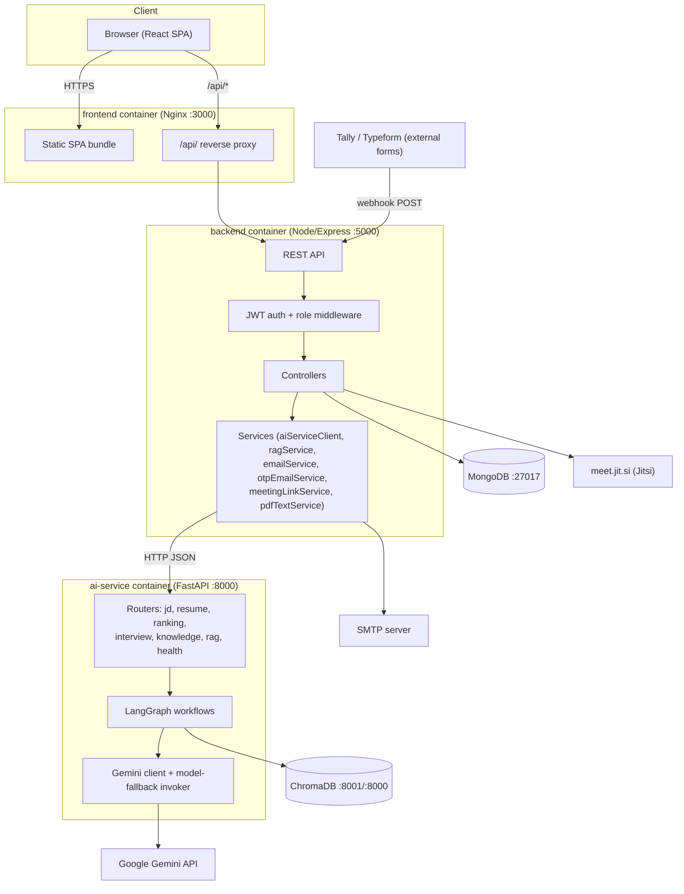
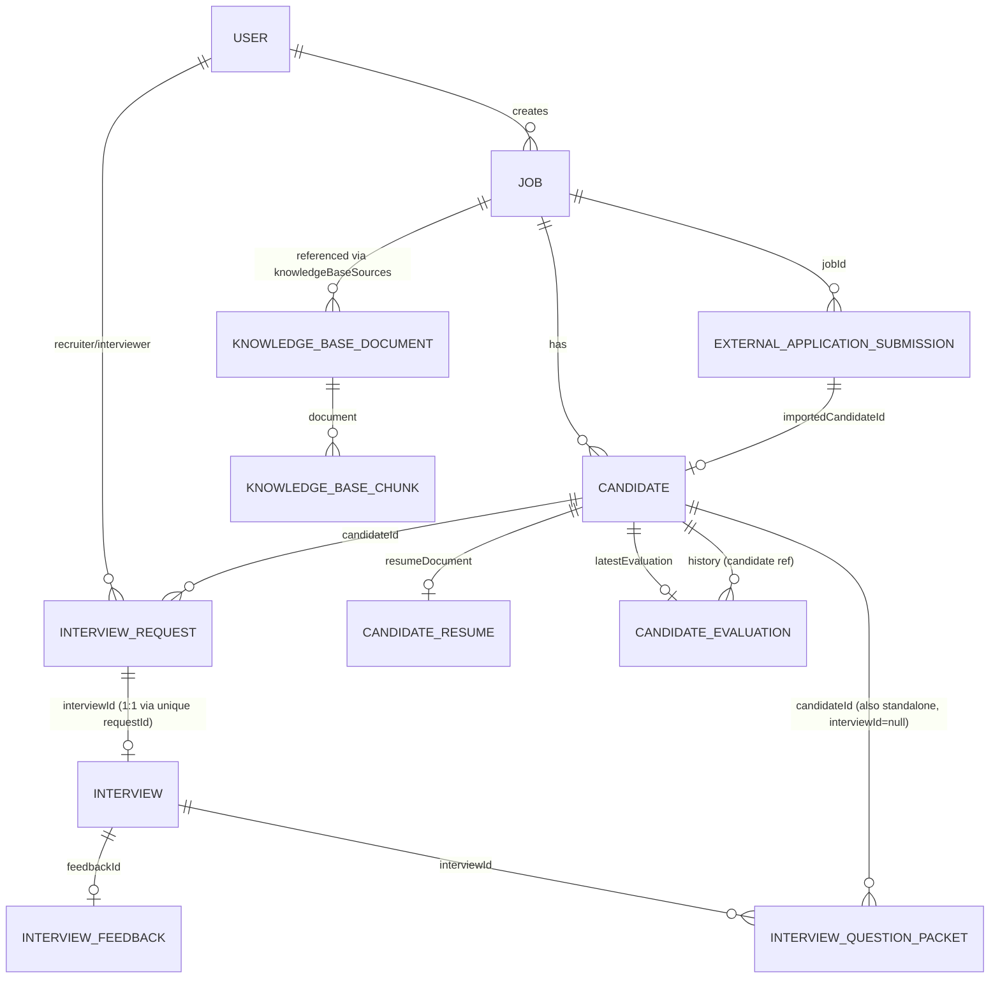
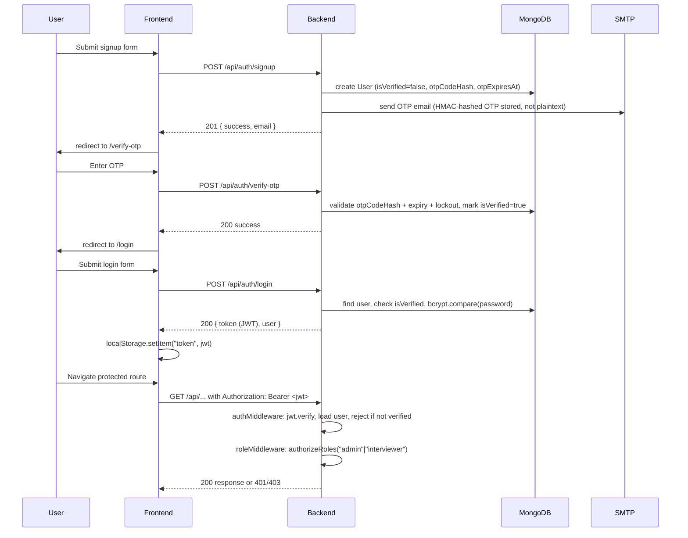
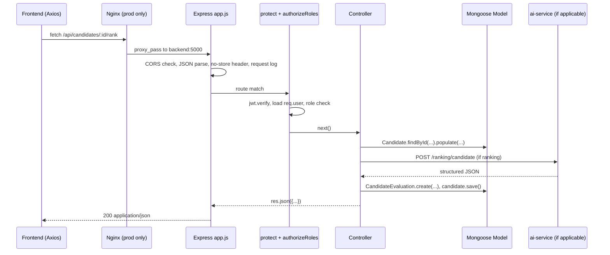
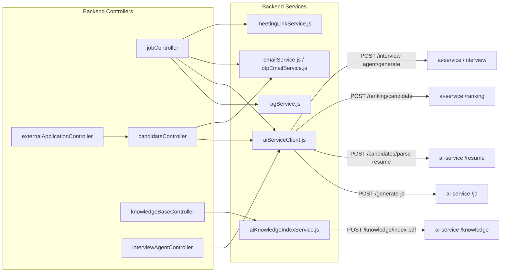
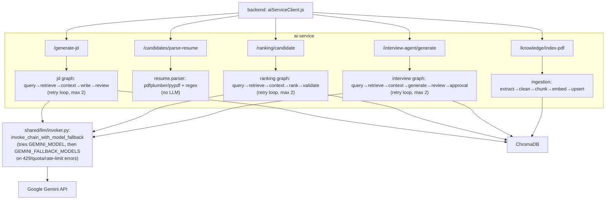

# Architecture

## High-Level Architecture

The system is a three-tier, three-service application orchestrated by Docker Compose. The backend is the single source of truth for business data (MongoDB) and the only service the frontend talks to. All AI/LLM work is delegated to the Python `ai-service`, which is stateless with respect to business data — it receives everything it needs in the request payload and returns structured JSON.

### Services

| Service | Responsibility | Talks to |
|---|---|---|
| `frontend` | React SPA, all UI, role-based routing | `backend` only (via `/api`) |
| `backend` | Auth, business logic, MongoDB persistence, orchestrates AI calls, sends email, generates meeting links | `mongo`, `ai-service`, SMTP, Jitsi (link generation only, no API call) |
| `ai-service` | LLM prompt orchestration (LangGraph), PDF parsing, RAG retrieval/embedding, ChromaDB indexing | `chromadb`, Google Gemini API |
| `mongo` | System of record: users, jobs, candidates, resumes, evaluations, interviews, knowledge base metadata | — |
| `chromadb` | Vector store for knowledge-base chunk embeddings | — |

---

## Frontend Architecture

- **Stack**: React 18 + Vite 6, React Router 7 (`BrowserRouter`), Tailwind CSS 3, Axios.
- **Entry point**: `src/main.jsx` mounts `<BrowserRouter><AuthProvider><ErrorBoundary><App/></ErrorBoundary></AuthProvider></BrowserRouter>`.
- **Auth state**: `src/context/AuthContext.jsx` — a React Context holding `{ user, loading }`, backed by a JWT in `localStorage`. On mount it calls `GET /auth/me` if a token exists to rehydrate the session.
- **HTTP client**: `src/api/axios.js` — a single shared Axios instance (`baseURL` from `VITE_API_URL`, defaulting to `/api`-suffixed). A request interceptor injects `Authorization: Bearer <token>`; a response interceptor clears the token on `401`.
- **Route guards**:
  - `ProtectedRoute` — redirects to `/login` if not authenticated.
  - `RoleRoute` — redirects to `/dashboard` (or `/interviewer/pending` for interviewers) if the user's role isn't in `allowedRoles`.
  - Guarding is **client-side only**; the backend independently enforces authorization via `authMiddleware` + `roleMiddleware` on every route — the frontend guard is a UX convenience, not a security boundary.
- **Layouts**: `DashboardLayout` (admin, nested `<Outlet/>` routes under `/dashboard`) and `AppLayout` (interviewer, wraps each `/interviewer/*` page individually).
- **Page-to-domain mapping**: `Candidates.jsx` is the largest page — it owns job selection, webhook-application intake, ranking triggers, shortlisting, and interview-request initiation. `CreateJob.jsx` owns the JD-generation workflow. `interviewer/*` and `recruiter/*` subfolders split the interview lifecycle by role.

## Backend Architecture

- **Stack**: Node.js + Express 4, Mongoose 8 (MongoDB ODM), JWT, Multer (file upload), Nodemailer, Axios (as an HTTP client to ai-service), `pdf-parse`.
- **Layering** (`backend/src/`):
  1. `routes/*.js` — declare paths + HTTP methods, apply `protect` (JWT auth) and `authorizeRoles(...)` (RBAC) middleware, delegate to controllers.
  2. `controllers/*.js` — request validation, orchestration, response shaping. No direct HTTP/Express concerns leak into services.
  3. `services/*.js` — integration adapters: `aiServiceClient.js` (all HTTP calls to ai-service), `ragService.js` (MongoDB text-search based knowledge retrieval used for JD generation only), `emailService.js` / `otpEmailService.js` (Nodemailer), `meetingLinkService.js` (Jitsi link/room-id generation, no external call), `pdfTextService.js` (legacy `pdf-parse`-based extraction, used by `knowledgeBaseIndexService.js` which is currently unused by the active knowledge-base flow — the active flow calls `aiKnowledgeIndexService.js`, which forwards the PDF to the ai-service).
  4. `models/*.js` — Mongoose schemas (17 total): `User`, `Job`, `Candidate`, `CandidateResume`, `CandidateEvaluation`, `Interview`, `InterviewRequest`, `InterviewFeedback`, `InterviewQuestionPacket`, `InterviewAssignment`, `InterviewSchedule`, `Questionnaire`, `KnowledgeBaseDocument`, `KnowledgeBaseChunk`, `ExternalApplicationSubmission`, `WebhookDebugEvent`, `AIJobGenerationLog`.
  5. `middleware/` — `authMiddleware.js` (JWT verify + attach `req.user`, rejects unverified emails), `roleMiddleware.js` (`authorizeRoles(...roles)` factory), `uploadMiddleware.js` (Multer disk storage, PDF-only filter, 10MB limit, separate `knowledge-base/` and `resumes/` subfolders under `backend/uploads/`).
  6. `utils/logger.js` — a minimal structured console logger (`info`/`warn`/`error` with timestamp + metadata object); there is no external log aggregation configured.

- **`app.js`** wires: CORS (origin allow-list from `CLIENT_URL`), JSON/urlencoded body parsers (10MB limit), a `no-store` cache-control header on all `/api` responses, request logging, a root `POST /` handler that special-cases Tally's default webhook delivery (`User-Agent: "Tally Webhooks"` or `eventType: "FORM_RESPONSE"` with no path), then mounts all routers, a 404 handler, and a final error-handling middleware that maps known error shapes (PDF-only rejection, file-too-large, webhook-path errors always return `200` so providers don't retry) to HTTP responses.

- **`server.js`** connects to MongoDB (`config/db.js`) then starts the HTTP listener on `PORT`.

## Database Architecture (MongoDB)

Mongoose is used with no formal migration tool — schema evolution happens by adding fields with defaults. Key relationships:

Notable design points:
- `Candidate.match` is a legacy inline field (score/matchedSkills/missingSkills/riskNotes); the active ranking flow instead creates a separate `CandidateEvaluation` document and points `Candidate.latestEvaluation` at it, preserving history.
- `Candidate.rankingStatus` is a state machine: `pending → parsing → ready → ranking → ranked` (or `failed` at any step), used to gate which candidates are eligible for ranking (`getRankingEligibility` in `candidateController.js`).
- `Interview.requestId` has a unique index — each `InterviewRequest` produces at most one `Interview`.
- `ExternalApplicationSubmission` has a compound unique index on `(jobId, email)` and a sparse unique index on `submissionId`, so re-delivered webhooks upsert rather than duplicate.
- Full-text search index on `KnowledgeBaseChunk.text` backs the backend's own lightweight `ragService.js` (used only for JD generation's knowledge-context fetch before calling ai-service); this is separate from the ai-service's ChromaDB-based semantic retrieval used by ranking/interview generation.
- There is a duplicated interview-scheduling data model: `Interview`/`InterviewRequest` (the actively used recruiter↔interviewer flow) and `InterviewAssignment`/`InterviewSchedule`/`Questionnaire` (an older/alternate model still served by `interviewerRoutes.js` → `interviewerController.js`, but not exercised by the current `Interviews.jsx` frontend flow, which uses `interviewRequestRoutes.js`/`interviewRoutes.js` instead).

## Authentication Flow

Key details:
- OTP is a 6-digit numeric code, HMAC-SHA256 hashed with `OTP_SECRET` (falls back to `JWT_SECRET`) before storage — never stored or logged in plaintext.
- OTP expires after 5 minutes; resend is rate-limited to once per 30 seconds; 5 failed verify attempts lock the account for 10 minutes.
- JWT payload is `{ userId }`, signed with `JWT_SECRET`, default expiry `7d`.
- `authMiddleware` re-checks `emailVerified`/`isVerified` on every request (not just at login), so a user who somehow got a token before verifying is still blocked.
- There are two roles: `admin` and `interviewer` (the `User` model's `role` enum). "Recruiter" in the UI/docs refers to the `admin` role acting as a recruiter — there is no separate `recruiter` value in the schema.

## Request Lifecycle (typical authenticated request)

Errors are funneled to Express's final error-handling middleware in `app.js`, which special-cases Multer/PDF errors and always returns `200` for `/api/webhooks/*` paths (so Tally/Typeform don't retry-storm on validation failures) while returning the real status code (`error.status || 500`) everywhere else.

## Service Interactions

## AI Integration Flow

All AI capability lives behind `ai-service`, called exclusively by `backend/src/services/aiServiceClient.js` over HTTP+JSON (with a 120s timeout). The backend never calls Gemini or ChromaDB directly. See [AI_WORKFLOW.md](AI_WORKFLOW.md) for the full per-capability breakdown (prompts, retries, model fallback).

Design notes:
- Every LangGraph workflow follows the same shape: build query → retrieve KB context (via a LangChain tool-calling step with a direct-retrieval fallback) → assemble prompt payload → call LLM → validate/parse structured output → conditionally retry (up to 2 times) with the validation error fed back into the retry prompt.
- `jd/service.py`, `ranking/graph.py`, and `interview/service.py` all invoke Gemini through `invoke_chain_with_model_fallback`, which iterates `[GEMINI_MODEL, *GEMINI_FALLBACK_MODELS]` and only advances to the next model on a detected quota/rate-limit error (`429`, `quota`, `rate limit`, `resourceexhausted`) — any other exception is raised immediately (fail-fast).
- Resume parsing (`/candidates/parse-resume`) is the one capability with **no LLM dependency** — it's deterministic PDF-text-extraction + regex section-splitting, so it is unaffected by Gemini quota/availability.

## External Services

| External service | Used for | Failure mode |
|---|---|---|
| **Google Gemini API** | JD writing, candidate ranking, interview question generation | On quota/rate-limit, retries across `GEMINI_FALLBACK_MODELS`; on missing API key, raises `GeminiRequestError` immediately |
| **ChromaDB** | Vector storage/retrieval of knowledge-base chunk embeddings | On connection failure, the ai-service transparently falls back to a local JSON file (`chroma_data/fallback_vector_store.json`) with in-process cosine-similarity search |
| **SMTP (Nodemailer)** | OTP emails, interview-scheduled emails, accept/reject decision emails | Throws `EmailDeliveryError`/`Error` with a clear "SMTP_HOST is not configured" message if unset; the calling controller surfaces this as a `502` |
| **Jitsi Meet (`meet.jit.si`)** | Interview video meeting links | Link/room-id is generated locally (slugified string), no API call is made — cannot itself fail, but a malformed base URL would produce a broken link |
| **Tally / Typeform** | External candidate application forms, delivered via webhook | Webhook handlers always return HTTP `200` (even on validation failure) to avoid provider retry storms; failures are recorded in `WebhookDebugEvent` for admin visibility via `GET /external-applications/summary` |
